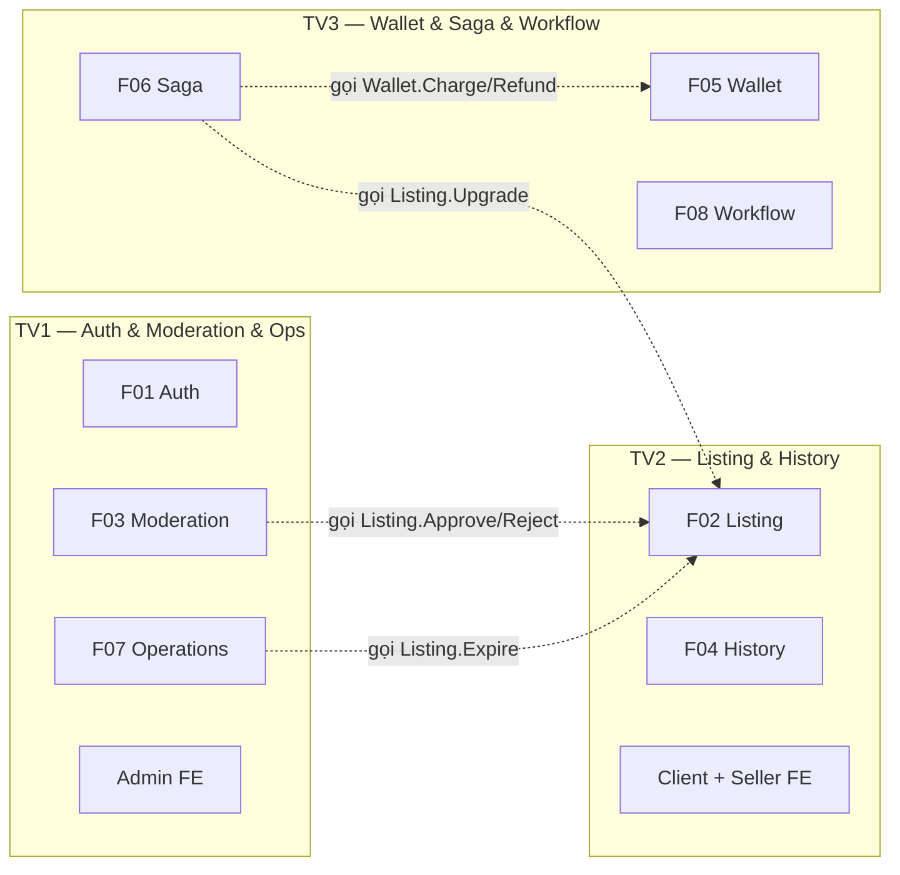
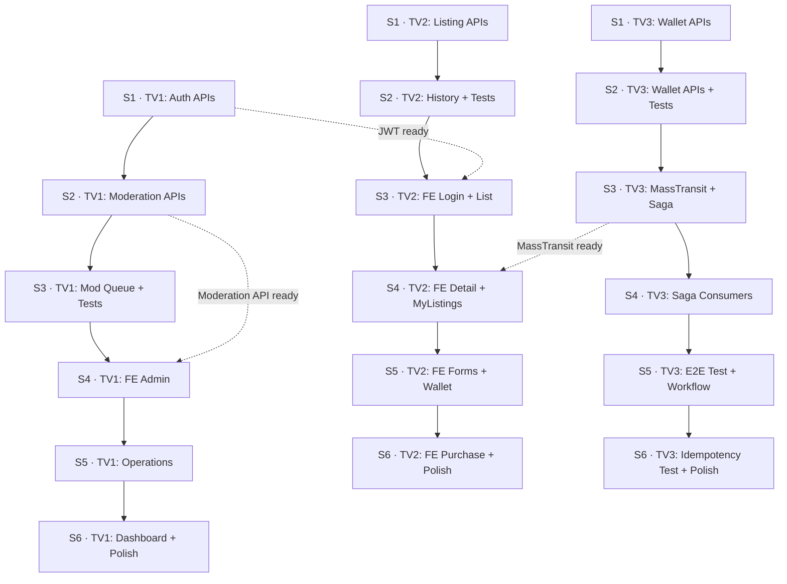

# PropNest — Kế hoạch 6 Sprint (3 thành viên)

## Nguyên tắc phân công

### Domain Ownership — Mỗi người "sở hữu" 1 nhóm module xuyên suốt dự án

| Thành viên | Domain sở hữu | Feature | Backend | Frontend |
|:---:|:---|:---|:---:|:---:|
| **TV1** | Auth + Moderation + Operations | F01, F03, F07 | 12 task | 4 task |
| **TV2** | Listing + History + 1 Saga consumer | F02, F04, F06 (1 task) | 7 task | 7 task |
| **TV3** | Wallet + Saga core + Workflow | F05, F06 (7 task), F08 | 16 task | 0 task |

> **Tổng: TV1 = 16 task · TV2 = 14 task · TV3 = 16 task**

### Lý do phân chia như vậy

- **TV1** phụ trách Auth (xác thực) và Moderation (kiểm duyệt) vì 2 module này liên quan mật thiết: Moderator phải đăng nhập → dùng JWT → approve/reject. Operations (Quartz job, health check, logging) giao cho TV1 vì backend của TV1 kết thúc sớm nhất (Sprint 3), còn dư thời gian cho DevOps.
- **TV2** phụ trách Listing (tin đăng) và History (lịch sử) vì History gắn chặt với mọi hành động trên Listing. TV2 cũng làm phần lớn Frontend vì họ hiểu rõ data model Listing nhất.
- **TV3** phụ trách Wallet + Saga + Workflow vì đây là chuỗi nghiệp vụ liền mạch: charge wallet → saga orchestrate → track workflow. TV3 tập trung 100% backend (kỹ thuật khó nhất), không làm FE.

---

## Sprint 1 — Foundation APIs

> **Mục tiêu sprint:** Auth hoạt động (đăng ký + đăng nhập + JWT), Listing API hoàn chỉnh, Wallet foundation có sẵn.
> **Demo cuối sprint:** Đăng ký user trên Swagger → đăng nhập nhận JWT → gọi GET /listings thấy danh sách.

| Task | Assign | Feature | Ghi chú |
|:-----|:------:|:-------:|:--------|
| Tạo JwtTokenService – sinh JWT access token | TV1 | F01 | Interface ở Application, impl ở Infrastructure |
| Implement POST /api/v1/auth/register | TV1 | F01 | Dùng UserManager, default role Seller |
| Implement POST /api/v1/auth/login | TV1 | F01 | Verify password → sinh JWT + role claim |
| Implement GET /api/v1/listings – danh sách với filter & phân trang | TV2 | F02 | Public endpoint, query projection |
| Implement POST /api/v1/listings/{id}/hide | TV2 | F02 | Owner only, từ Published → Hidden |
| Bổ sung authorization check owner cho Update, Submit, Hide | TV2 | F02 | So sánh OwnerUserId với JWT sub |
| Tạo PackageDefinition entity, configuration và seed data | TV3 | F05 | Standard, VIP, Boost + migration |
| Tạo WalletService và auto-create ví khi đăng ký | TV3 | F05 | Hook vào register flow cuối sprint |
| Implement POST /api/v1/wallets/top-up | TV3 | F05 | Demo nạp tiền, RowVersion concurrency |

> [!TIP]
> **Không blocking:** TV1 build Auth, TV2 build Listing API, TV3 build Wallet — ba module hoàn toàn độc lập. TV3 hook auto-create wallet vào register ở cuối sprint sau khi TV1 merge register.

---

## Sprint 2 — Core Business Logic

> **Mục tiêu sprint:** Moderation flow hoàn chỉnh (approve/reject), History queryable, Wallet API done + unit tested.
> **Demo cuối sprint:** Moderator approve tin → tin Published; xem history delta before/after; xem số dư ví.

| Task | Assign | Feature | Ghi chú |
|:-----|:------:|:-------:|:--------|
| Seed default roles khi application startup | TV1 | F01 | Seller, Moderator, Admin |
| Tạo ModerationController: POST /moderation/listings/{id}/approve | TV1 | F03 | Gọi Listing.Approve(), ghi review + history |
| Implement POST /moderation/listings/{id}/reject | TV1 | F03 | Bắt buộc reason, ghi review + history |
| Unit test cho Listing state transitions | TV2 | F02 | Cover mọi valid/invalid transition |
| Implement GET /api/v1/listings/{id}/history | TV2 | F04 | Read-model, trả snapshot + delta |
| Unit test cho DeltaEngine | TV2 | F04 | Price change, null↔value, no change |
| Implement GET /api/v1/wallets/me | TV3 | F05 | Main + Promo + Total balance |
| Implement GET /api/v1/wallets/me/transactions | TV3 | F05 | Phân trang, filter theo type |
| Unit test cho Wallet domain logic | TV3 | F05 | Charge promo-first, insufficient, refund |

> [!TIP]
> **Không blocking:** TV1 gọi `Listing.Approve()` / `Listing.Reject()` là domain method đã có sẵn từ trước — không cần đợi TV2. TV2 làm history + test listing. TV3 hoàn thiện wallet API.

---

## Sprint 3 — Backend Completion + Saga Setup

> **Mục tiêu sprint:** Toàn bộ non-Saga backend API hoàn tất. MassTransit + RabbitMQ sẵn sàng. FE bắt đầu.
> **Demo cuối sprint:** GET /moderation/listings trả queue; MassTransit connected RabbitMQ (log); FE trang login hiển thị.

| Task | Assign | Feature | Ghi chú |
|:-----|:------:|:-------:|:--------|
| Implement GET /moderation/listings – hàng đợi chờ duyệt | TV1 | F03 | FIFO, include owner info |
| Unit test cho Auth flow | TV1 | F01 | register, login, duplicate email, wrong password |
| Unit test cho Moderation flow | TV1 | F03 | approve/reject success, wrong status, no reason |
| Build trang đăng nhập / đăng ký (FE) | TV2 | Client | Gọi API auth, lưu JWT |
| Build trang danh sách tin – Listing List Page (FE) | TV2 | Client | Gọi GET /listings, filter, phân trang |
| Cài đặt MassTransit + RabbitMQ transport | TV3 | F06 | Package config, bus registration |
| Viết PurchasePackageSaga state machine | TV3 | F06 | Persist EF Core, define states/events |
| Viết DeductWalletConsumer | TV3 | F06 | Gọi Wallet.Charge, inbox dedup |

> [!TIP]
> **Không blocking:** TV1 hoàn tất backend (test + moderation queue). TV2 bắt đầu FE sớm vì backend listing đã xong — dùng API Sprint 1-2 đã merge. TV3 setup Saga infrastructure độc lập.

---

## Sprint 4 — Saga Completion + Frontend Core

> **Mục tiêu sprint:** Saga chạy end-to-end (happy path + compensation). FE có đủ trang chính.
> **Demo cuối sprint:** Purchase package → Saga complete; FE listing detail + seller dashboard hiển thị.

| Task | Assign | Feature | Ghi chú |
|:-----|:------:|:-------:|:--------|
| Build trang hàng đợi kiểm duyệt – Moderation Queue (FE) | TV1 | Admin | Gọi GET /moderation/listings |
| Build trang chi tiết duyệt – Moderation Detail (FE) | TV1 | Admin | Approve/Reject buttons |
| Viết UpgradeListingConsumer | TV2 | F06 | TV2 hiểu Listing domain → viết consumer này |
| Build trang chi tiết tin – Listing Detail Page (FE) | TV2 | Client | Gallery, full info |
| Build trang quản lý tin – My Listings (FE) | TV2 | Seller | Status badges, action buttons |
| Viết RefundWalletConsumer (compensation) | TV3 | F06 | Gọi Wallet.Refund, ghi ledger |
| Chuyển OutboxDispatchService sang MassTransit publisher | TV3 | F06 | Thay LoggingPublisher |
| Tạo InboxMessage entity và consumer deduplication filter | TV3 | F06 | Unique constraint, migration |

> [!TIP]
> **Không blocking:** TV1 làm FE Admin (dùng API moderation đã xong Sprint 2-3). TV2 viết UpgradeListingConsumer (MassTransit đã setup bởi TV3 Sprint 3 — đã merge) + FE client/seller. TV3 hoàn thiện Saga backend.

> [!IMPORTANT]
> **Dependency duy nhất cross-sprint:** TV2 viết `UpgradeListingConsumer` cần MassTransit infrastructure đã setup bởi TV3 ở Sprint 3. Đảm bảo TV3 merge MassTransit setup **trước khi** Sprint 4 bắt đầu.

---

## Sprint 5 — Operations + Frontend Seller

> **Mục tiêu sprint:** Quartz job expire tự động, health check, Serilog. FE Seller hoàn thiện. Workflow status API done.
> **Demo cuối sprint:** Tin Published hết hạn → tự Expired; /health OK; FE form tạo tin + xem ví hoạt động.

| Task | Assign | Feature | Ghi chú |
|:-----|:------:|:-------:|:--------|
| Implement ListingExpirationJob bằng Quartz.NET | TV1 | F07 | Mỗi 5 phút, batch 100 |
| Mở rộng Health Checks cho RabbitMQ | TV1 | F07 | /health trả chi tiết components |
| Cấu hình Serilog structured logging | TV1 | F07 | JSON, CorrelationId enrichment |
| Build form tạo/sửa tin đăng (FE) | TV2 | Seller | Validation, concurrency conflict |
| Build trang xem lịch sử thay đổi tin (FE) | TV2 | Seller | Timeline, diff highlight |
| Build trang ví Seller (FE) | TV2 | Seller | Balance cards, transaction table |
| Test end-to-end Saga happy path & failure path | TV3 | F06 | Happy → Complete, Fail → Compensate |
| Ghi WorkflowStep cho mỗi bước Saga transition | TV3 | F08 | Read model cho FE poll |
| Hoàn thiện GET /workflows/{correlationId} response | TV3 | F08 | Include steps array |

> [!TIP]
> **Không blocking:** TV1 làm Operations (Quartz, health, logging) — cross-cutting, không phụ thuộc ai. TV2 làm FE Seller dùng API đã xong. TV3 test Saga + hoàn thiện Workflow Status.

---

## Sprint 6 — Polish, Purchase Flow + Demo Prep

> **Mục tiêu sprint:** FE mua gói + admin dashboard. Bug fix. Demo end-to-end.
> **Demo cuối sprint:** Full demo kịch bản end-to-end: đăng ký → đăng tin → duyệt → mua gói → xem workflow → tin expire.

| Task | Assign | Feature | Ghi chú |
|:-----|:------:|:-------:|:--------|
| Build trang dashboard Admin (FE) | TV1 | Admin | 4 metric cards |
| Bug fix + polish module Auth & Moderation & Ops | TV1 | — | Review code, fix edge cases |
| Build flow mua gói dịch vụ – Purchase Package (FE) | TV2 | Seller | Idempotency-Key, poll workflow |
| Bug fix + polish module Listing & History & FE | TV2 | — | Review code, fix edge cases |
| Unit test cho Idempotency logic | TV3 | F08 | same key replay, diff hash conflict |
| Bug fix + polish module Wallet & Saga & Workflow | TV3 | — | Review code, fix edge cases |

> [!TIP]
> Sprint 6 nhẹ hơn có chủ đích — dành thời gian cho bug fix, code review cross-team, và chuẩn bị demo.

---

## Tổng hợp workload

### Theo Sprint

| Sprint | TV1 | TV2 | TV3 | Tổng |
|:------:|:---:|:---:|:---:|:----:|
| 1 | 3 | 3 | 3 | 9 |
| 2 | 3 | 3 | 3 | 9 |
| 3 | 3 | 2 | 3 | 8 |
| 4 | 2 | 3 | 3 | 8 |
| 5 | 3 | 3 | 3 | 9 |
| 6 | 2 | 2 | 2 | 6 |
| **Tổng** | **16** | **16** | **17** | **49** |

### Theo loại công việc

| | Backend | Frontend | Test/Polish |
|:---|:---:|:---:|:---:|
| **TV1** | 9 | 4 | 3 |
| **TV2** | 4 | 8 | 4 |
| **TV3** | 14 | 0 | 3 |

> [!NOTE]
> TV3 không làm Frontend nhưng phụ trách phần backend kỹ thuật nặng nhất (Saga, MassTransit, Outbox, Compensation). Đây là trade-off hợp lý: TV3 cần tập trung 100% vào distributed systems.

---

## Dependency Map giữa các Sprint

> [!IMPORTANT]
> **Điểm phụ thuộc cross-team duy nhất:** TV2 Sprint 4 viết `UpgradeListingConsumer` cần TV3 đã merge MassTransit setup ở Sprint 3. Ngoài ra **không có blocking** nào khác.
